# Automated System Workflow & Feature Test Matrix

This document details the complete end-to-end integration workflow covering every feature across all user roles in BrightCare Medical System.

## Workflow Flowchart

```mermaid
flowchart TD
    subgraph S1["Phase 1: Admin User Provisioning & Management"]
        A1[Login as Admin] --> A2[Register Doctor 1, Doctor 2, Receptionist, Patient 1, Temp User]
        A2 --> A3[List Users & Search User by Email/Name]
        A3 --> A4[Edit Doctor 2 Specialization & Delete Temp User]
        A4 --> A5[Admin Logout]
    end

    subgraph S2["Phase 2: Receptionist Walk-in Registration"]
        A5 --> R1[Login as Receptionist]
        R1 --> R2[Register Patient 2]
        R2 --> R3[Receptionist Logout]
    end

    subgraph S3["Phase 3: Doctor Schedule Configuration"]
        R3 --> D1[Login as Doctor 1]
        D1 --> D2[Add Slots Monday 09:00, Monday 10:00, Tuesday 14:00]
        D2 --> D3[View Schedules & Delete Tuesday 14:00 Slot]
        D3 --> D4[Doctor 1 Logout]
        D4 --> D5[Login Doctor 2 & Add Wednesday 09:00 Slot & Logout]
    end

    subgraph S4["Phase 4: Patient Profile & Appointment Booking"]
        D5 --> P1[Login as Patient 1]
        P1 --> P2[View & Update Profile Contact No / Name]
        P2 --> P3[Filter Doctors by Specialization]
        P3 --> P4[Book Appt 1 Monday 09:00 with Doc 1]
        P4 --> P5[Book Appt 2 Monday 10:00 with Doc 1]
        P5 --> P6[Book Appt 3 Wednesday 09:00 with Doc 2]
        P6 --> P7[View Upcoming Appts & Cancel Appt 2]
        P7 --> P8[Patient 1 Logout]
    end

    subgraph S5["Phase 5: Doctor Appointments, Consultations & Notes"]
        P8 --> DC1[Login Doctor 2 & Cancel Appt 3 & Logout]
        DC1 --> DC2[Login Doctor 1 & View Upcoming Appt 1]
        DC2 --> DC3[Initiate Consultation for Appt 1 with Fee & Notes]
        DC3 --> DC4[View Patient Medical History]
        DC4 --> DC5[Manage Consultations: List & Update Clinical Notes]
        DC5 --> DC6[Doctor 1 Logout]
    end

    subgraph S6["Phase 6: Patient Review of History & Notes"]
        DC6 --> PR1[Login as Patient 1]
        PR1 --> PR2[View Past Appointments - Completed Appt 1, Cancelled Appt 2]
        PR2 --> PR3[View Consultation Notes for Appt 1]
        PR3 --> PR4[Patient 1 Logout]
    end

    subgraph S7["Phase 7: Admin Reporting & Terminal Output Verification"]
        PR4 --> RP1[Login as Admin]
        RP1 --> RP2[Generate Monthly Appointment Report & Verify Terminal Output]
        RP2 --> RP3[Generate Doctor Consultation Report & Verify Terminal Output]
        RP3 --> RP4[Generate Patient Visit Summary Report & Verify Terminal Output]
        RP4 --> RP5[Admin Logout & Cleanup]
    end
```

## Role & Feature Coverage Matrix

| Role             | Feature Code | Feature Name                     | Description                                                                      |
| ---------------- | ------------ | -------------------------------- | -------------------------------------------------------------------------------- |
| **Admin**        | `A1`         | Register Doctor                  | Register new Doctor with Specialization                                          |
| **Admin**        | `A2`         | Register Patient                 | Register new Patient with Contact Number                                         |
| **Admin**        | `A3`         | Register Admin                   | Register secondary Administrator                                                 |
| **Admin**        | `A4`         | Register Receptionist            | Register Receptionist account                                                    |
| **Admin**        | `A5`         | List All Users                   | Retrieve and verify all system users                                             |
| **Admin**        | `A6`         | Search Users                     | Search user by Email / Full Name with terminal verification                      |
| **Admin**        | `A7`         | Edit User Details                | Update User properties (Name, Specialization, Contact)                           |
| **Admin**        | `A8`         | Delete User                      | Soft-delete a user record                                                        |
| **Admin**        | `A9`         | Monthly Appointment Report       | Aggregate appointments, cancellations & top doctors with terminal UI table       |
| **Admin**        | `A10`        | Doctor Consultation Report       | Aggregate consultations & doctor earnings with terminal UI table                 |
| **Admin**        | `A11`        | Patient Visit Summary Report     | Aggregate new patient registrations & consultation visits with terminal UI table |
| **Admin**        | `A12`        | Admin Logout                     | Invalidate admin session token                                                   |
| **Receptionist** | `R1`         | Register Patient                 | Register walk-in patient with auto-assigned Medical Record ID                    |
| **Receptionist** | `R2`         | Receptionist Logout              | Invalidate receptionist session token                                            |
| **Doctor**       | `D1`         | View Availability Schedules      | Fetch doctor weekly schedule time slots                                          |
| **Doctor**       | `D2`         | Add Schedule Slot                | Add availability slots with collision checking                                   |
| **Doctor**       | `D3`         | Delete Schedule Slot             | Delete unused availability slot                                                  |
| **Doctor**       | `D4`         | View Patient Appointments        | View active appointments booked for doctor                                       |
| **Doctor**       | `D5`         | Cancel Appointment (by Doctor)   | Cancel appointment from doctor perspective                                       |
| **Doctor**       | `D6`         | Initiate Consultation            | Record clinical notes and consultation fee                                       |
| **Doctor**       | `D7`         | View Patients with Consultations | List patients with completed consultations                                       |
| **Doctor**       | `D8`         | View Patient Medical History     | Inspect consultation history and notes for specific patient                      |
| **Doctor**       | `D9`         | Manage Consultations List        | View all clinic consultation records                                             |
| **Doctor**       | `D10`        | Update Consultation Notes        | Modify existing clinical notes                                                   |
| **Doctor**       | `D11`        | Doctor Logout                    | Invalidate doctor session token                                                  |
| **Patient**      | `P1`         | View Profile                     | View personal details and Medical Record ID                                      |
| **Patient**      | `P2`         | Update Profile                   | Update personal details (Name, Contact Number)                                   |
| **Patient**      | `P3`         | Filter & Select Doctors          | Filter available doctors by specialization                                       |
| **Patient**      | `P4`         | View Doctor Availability         | Check doctor weekly schedule and day slots                                       |
| **Patient**      | `P5`         | Book Appointment                 | Book appointment slot for doctor on specific date                                |
| **Patient**      | `P6`         | View Upcoming Appointments       | Retrieve active future appointments                                              |
| **Patient**      | `P7`         | Cancel Appointment (by Patient)  | Cancel scheduled appointment from patient perspective                            |
| **Patient**      | `P8`         | View Past Appointments           | Retrieve past completed and cancelled appointments                               |
| **Patient**      | `P9`         | View Consultation Notes          | Read doctor notes and fee for completed visits                                   |
| **Patient**      | `P10`        | Patient Logout                   | Invalidate patient session token                                                 |
